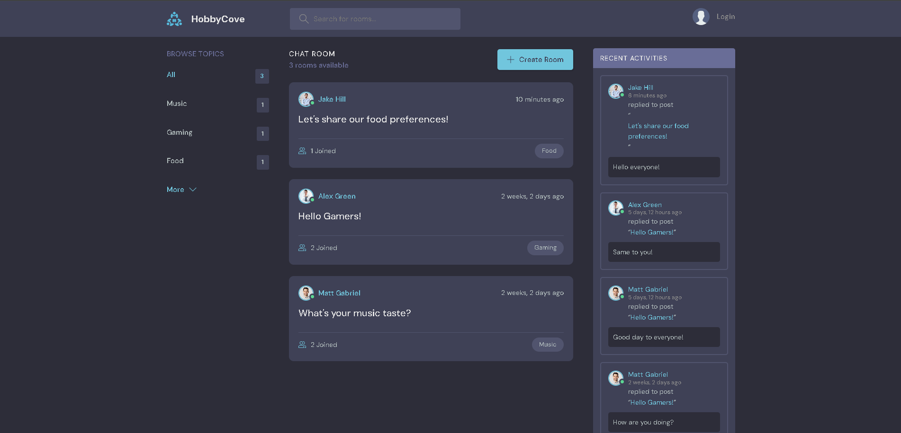
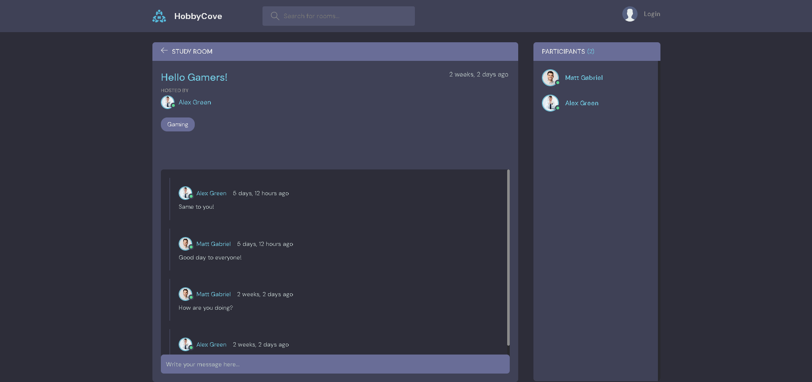

<div align="center">


# HobbyCove
A Discord-like Django web application for people who like to talk about their hobbies with others.
</div>

### Setting Up

--> Create a virtual environment :
```bash
# Install virtualenv first
pip install virtualenv

# Then we create our virtual environment
virtualenv envname

```

--> Activate the virtual environment :
```bash
envname\scripts\activate

```

--> Install the requirements :
```bash
pip install -r requirements.txt

```

#

### Running the App

--> To run the App, we use :
```bash
python manage.py runserver

```

> ⚠ Then, the development server will be started at http://127.0.0.1:8000/

#

### App Preview :

<table width="100%"> 
<tr>
<td width="50%">      
&nbsp; 
<br>
<p align="center">
  Home Preview
</p>

</td> 
<td width="50%">
<br>
<p align="center">
  Room Preview
</p>
  
</td>
</table>
